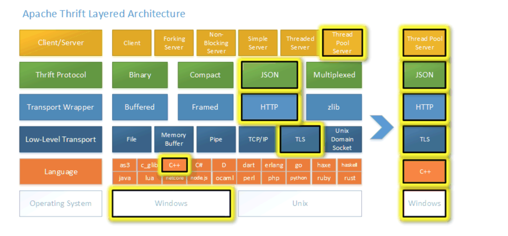

### 今日任务

```
flag: 锻炼、健身、读书

human capital (积累自己资本)
live like a hero （像英雄一样生活）
pay cut (薪水差)

```

* [ ] Kafka java 开发
* [ ] Maven Gradle 区别 Redux 文档
* [ ] Apache NetBeans 为何物
* [ ] RPC thrift c++ 开发
* [ ] apache httpd c 开发
* [ ] flink apache java开发
* [ ] apache hadoop java 开发
* [ ] rocketmq apache 消息队列 java
* [ ] activemq apache 消息队列 java
* [ ] zookeeper apache java
* [ ] tomcat apache java
* [ ] maven apache java
* [ ] vscode micosoft typescript
* [ ] micosoft TypeScript
* [ ] docker/compose python 开发
* [ ] docker/cli go 开发
* [ ] homebrew-cask ruby 开发
* [ ] zsh c 开发
* [ ] iterm2 oc 开发

***


## react 视图层框架

### redux 数据层框架

###### 工作原理：


antd 是基于 Ant Design 设计体系的 React UI 组件库，主要用于研发企业级中后台产品


* * *

##### 中后台：

```
前台，中台，后台，是针对业务来说的，要求不一样。

前台要求个性化，能体面公司的特色和对用户需求的满足

中台是第三方业务运营方，是公司把部分业务开放后，为别的公司的业务赋能

后台是公司内部的业务运营平台
```


* * *

>  thirft 说明





***

#### btc

