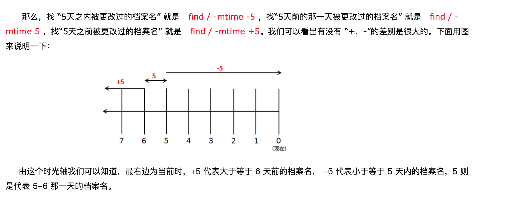

# find


我们知道 Linux里面一切皆文件 


https://www.cnblogs.com/qiaopei/p/5515189.html

https://zhuanlan.zhihu.com/p/124293455

ctime(写入文件内容/变更文件权限)

atime(访问文件的时间)

mtime(写入文件的内容)

最近访问时间 access time （-atime）、最近更改时间 modify time （-mtime） 和 最近状态改动时间 change time（-ctime），当然我们也看到了创建时间那一项为空白，也证实了Linux系统下是无法查看文件的创建时间的。




```

root@sldc-95:/tmp # stat a.log
  文件："a.log"
  大小：0         	块：0          IO 块：4096   普通空文件
设备：fd01h/64769d	Inode：396565      硬链接：1
权限：(0644/-rw-r--r--)  Uid：(    0/    root)   Gid：(    0/    root)
最近访问：2021-01-08 23:39:33.972745743 +0800
最近更改：2021-01-08 23:27:01.242758947 +0800
最近改动：2021-01-08 23:27:01.242758947 +0800
创建时间：-
```

