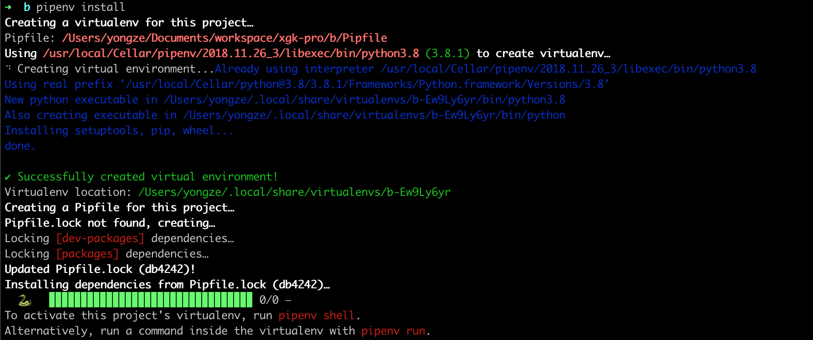
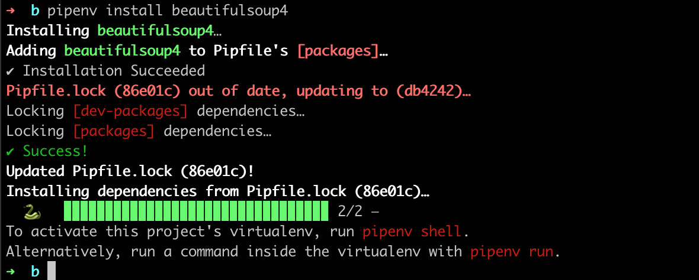
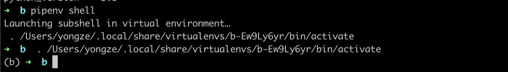

# pipenv

[github](https://github.com/pypa/pipenv)

### 简介

>pipenv - 官方推荐打包工具使用
>
>Kenneth Reitz的最新工具Pipenv可以用于简化Python项目中依赖项的管理。只用了一年， Pipenv 就变成了管理软件包依赖关系的 Python 官方推荐资源。 它汇集了Pip，Pipfile和Virtualenv的功能，是一个强大的命令行工具。

### 安装

> pip install pipenv

### 使用

pipenv install 



pipenv install beautifulsoup4




### 启动

进入虚拟环境

> Pipenv shell 



```

如果你想将当前使用 requirements.txt文件的项目转换为使用 Pipenv，请安装 Pipenv 并运行：pipenv install requirements.txt


更多用法
在使用pipenv之前，必须彻底的忘记pip这个东西

新建一个准备当环境的文件夹pipenvtest，并cd进入该文件夹：

pipenv --three 会使用当前系统的Python3创建环境

pipenv --python 3.6 指定某一Python版本创建环境

可通过参数--two 和--three 来泛指python版本，也可通过--python 3.5 来明确指定python版本

pipenv shell 激活虚拟环境

pipenv --where 显示目录信息

pipenv --venv 显示虚拟环境信息

pipenv --py 显示Python解释器信息

pipenv install requests 安装相关模块并加入到Pipfile

pipenv install django==1.11 安装固定版本模块并加入到Pipfile

pipenv graph 查看目前安装的库及其依赖

pipenv check 检查安全漏洞

pipenv uninstall --all 卸载全部包并从Pipfile中移除

```


### 删除虚拟环境

> pipenv --rm