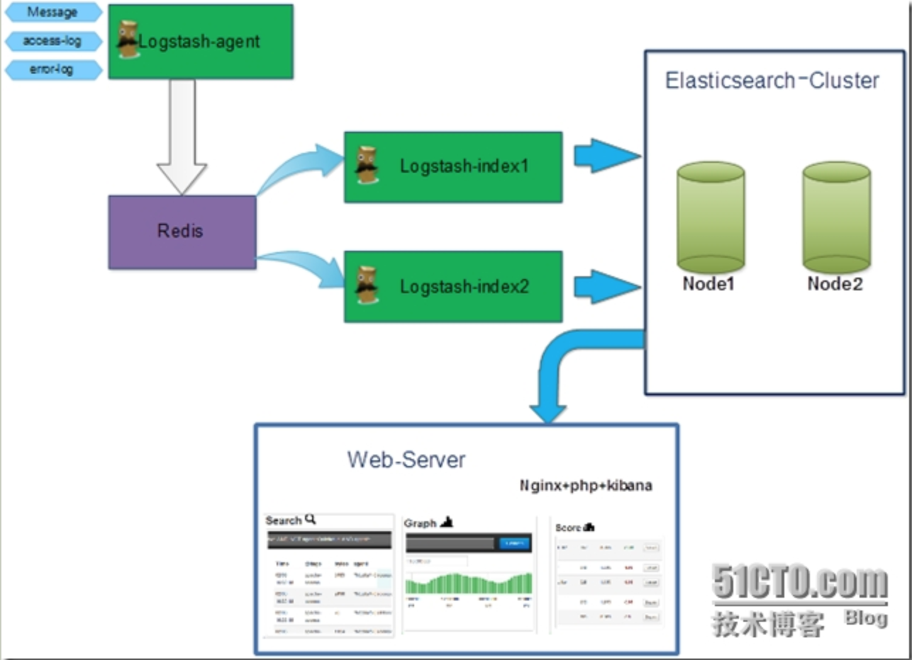
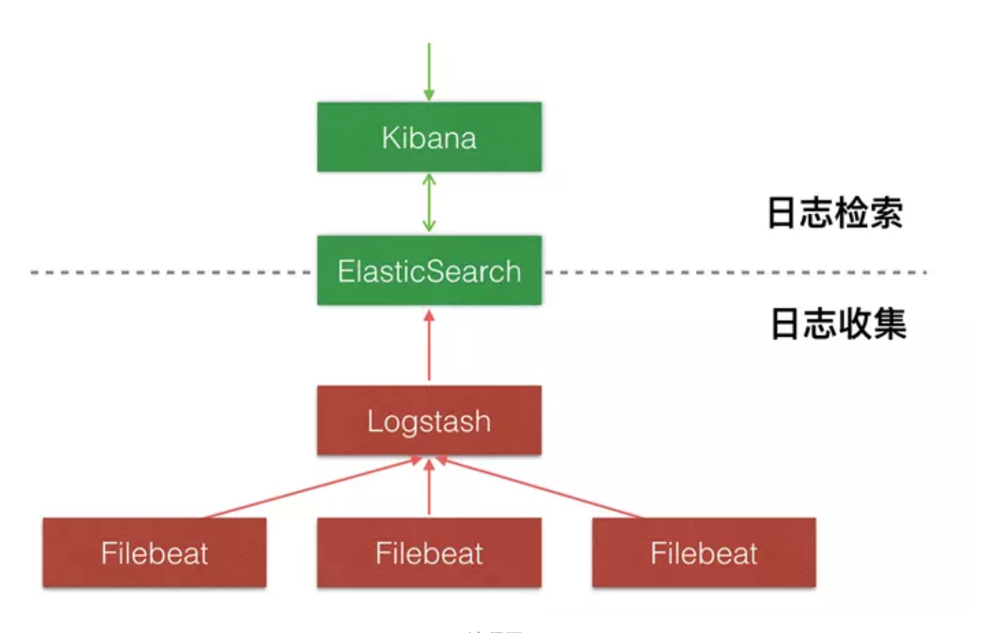
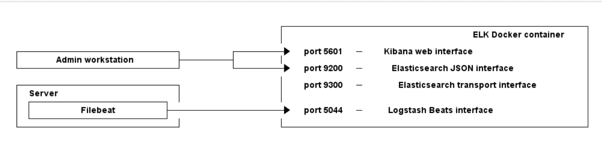

# elk docker

### 核心组成

> ELK由Elasticsearch、Logstash和Kibana三部分组件组成；
>
> Elasticsearch是个开源分布式搜索引擎，它的特点有：分布式，零配置，自动发现，索引自动分片，索引副本机制，restful风格接口，多数据源，自动搜索负载等。
>
>  Logstash是一个完全开源的工具，它可以对你的日志进行收集、分析，并将其存储供以后使用
>
>  kibana 是一个开源和免费的工具，它可以为 Logstash 和 ElasticSearch 提供的日志分析友好的 Web 界面，可以帮助您汇总、分析和搜索重要数据日志。

### 四大组件

> Logstash: logstash server端用来搜集日志；
>
>  Elasticsearch: 存储各类日志；
>
>  Kibana: web化接口用作查寻和可视化日志；
>
> Logstash Forwarder: logstash client端用来通过lumberjack 网络协议发送日志到logstash server；

### ELK工作流程

> 在需要收集日志的所有服务上部署logstash，作为logstash agent（logstash shipper）用于监控并过滤收集日志，将过滤后的内容发送到Redis，然后logstash indexer将日志收集在一起交给全文搜索服务ElasticSearch，可以用ElasticSearch进行自定义搜索通过Kibana 来结合自定义搜索进行页面展示。

### 工作流程

