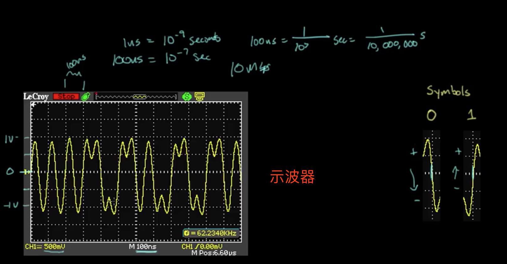
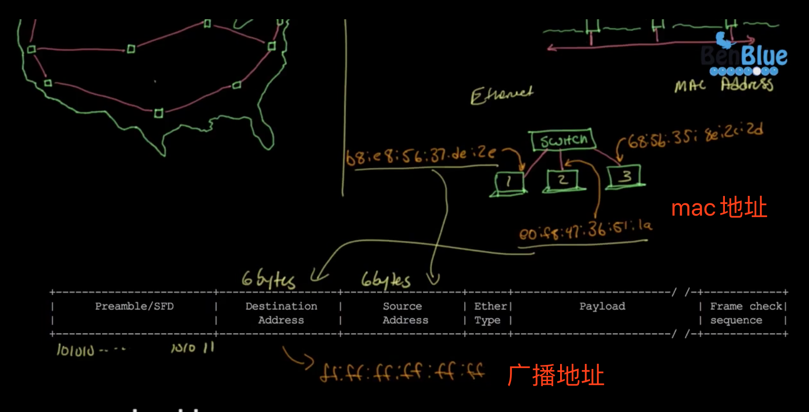
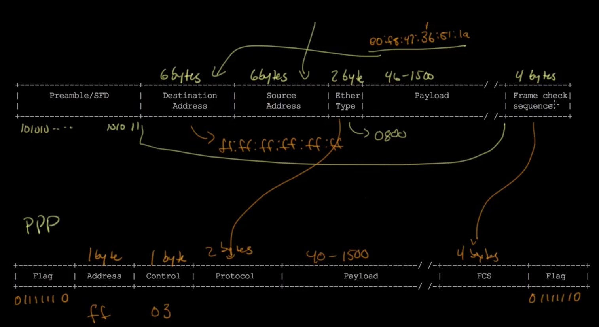
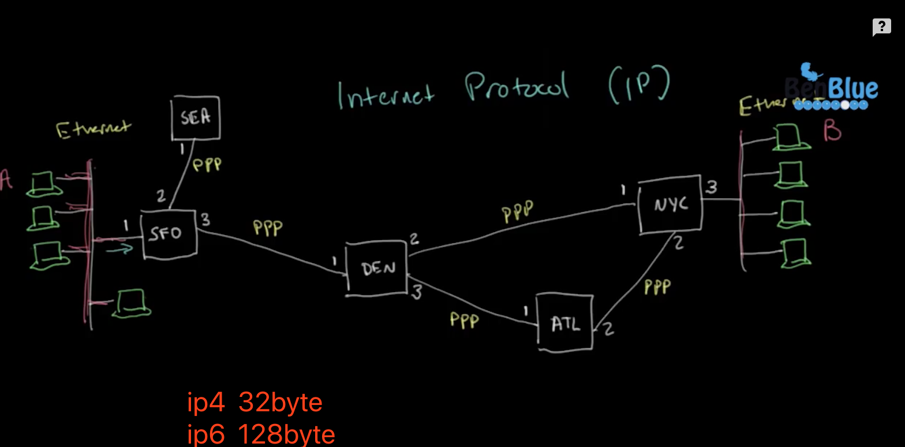
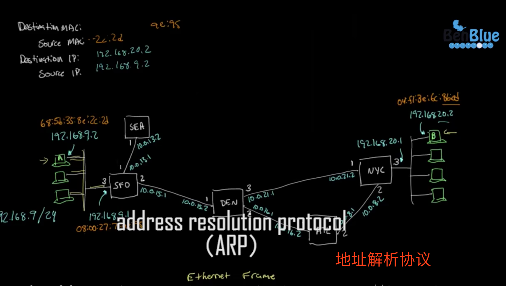
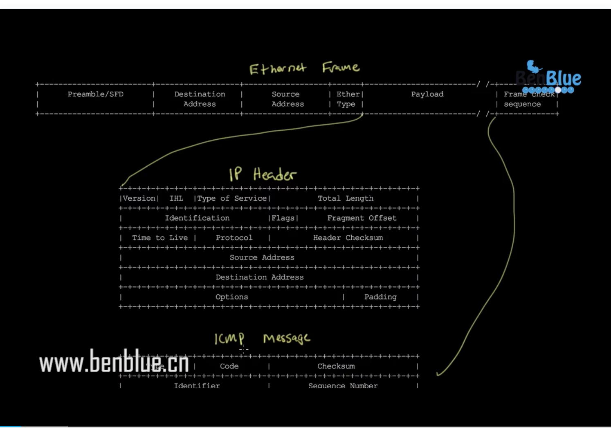

# TCP/IP

###  网络

##### 网络传输：

改进

曼彻斯特编码

示波器、10M/s 网络传输

解码【8位】

帧的开始位置怎么查

#### 互联网

帧中到底包含什么数据？

##### 点到点  互联网对比

1byte = 8bit

七层网络

ip 协议

广播帧

ping

Wireshark软件

ip 包中包括哪些？

Tcp 传输控制协议

Tcp 包什么样？

三次握手

tcp 四次分手

ip 地址 4bit

mac 地址 6bit

以太网

8根线